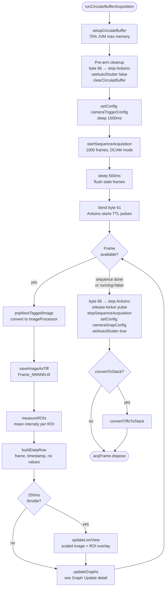
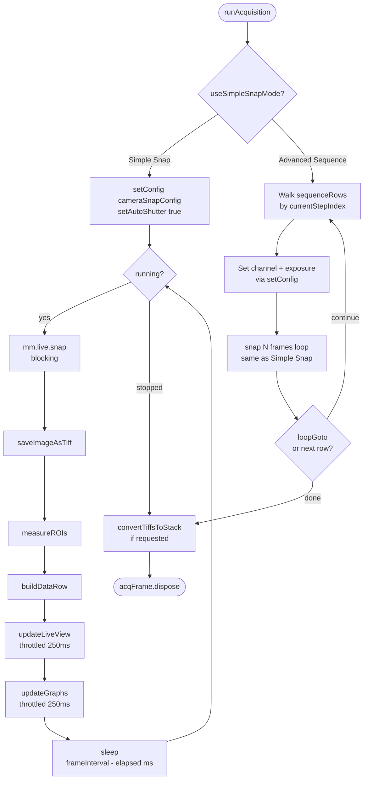
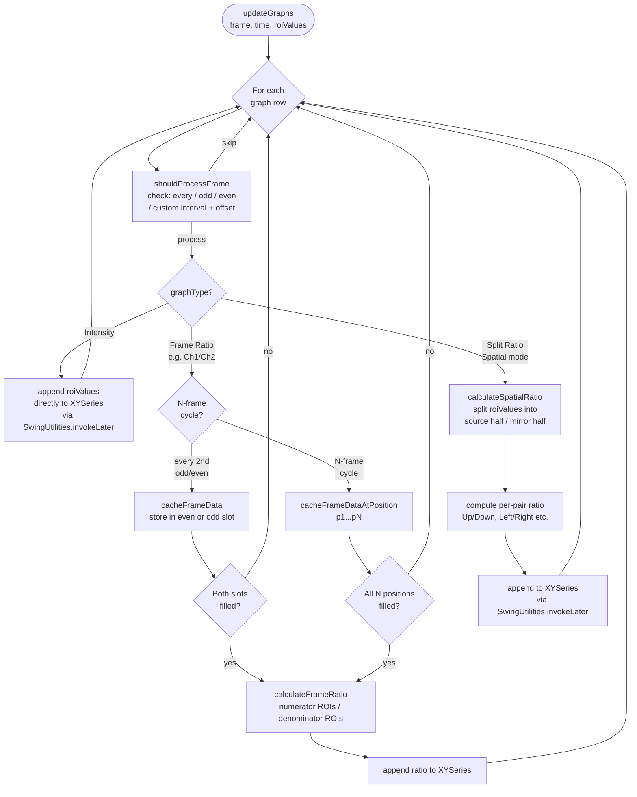
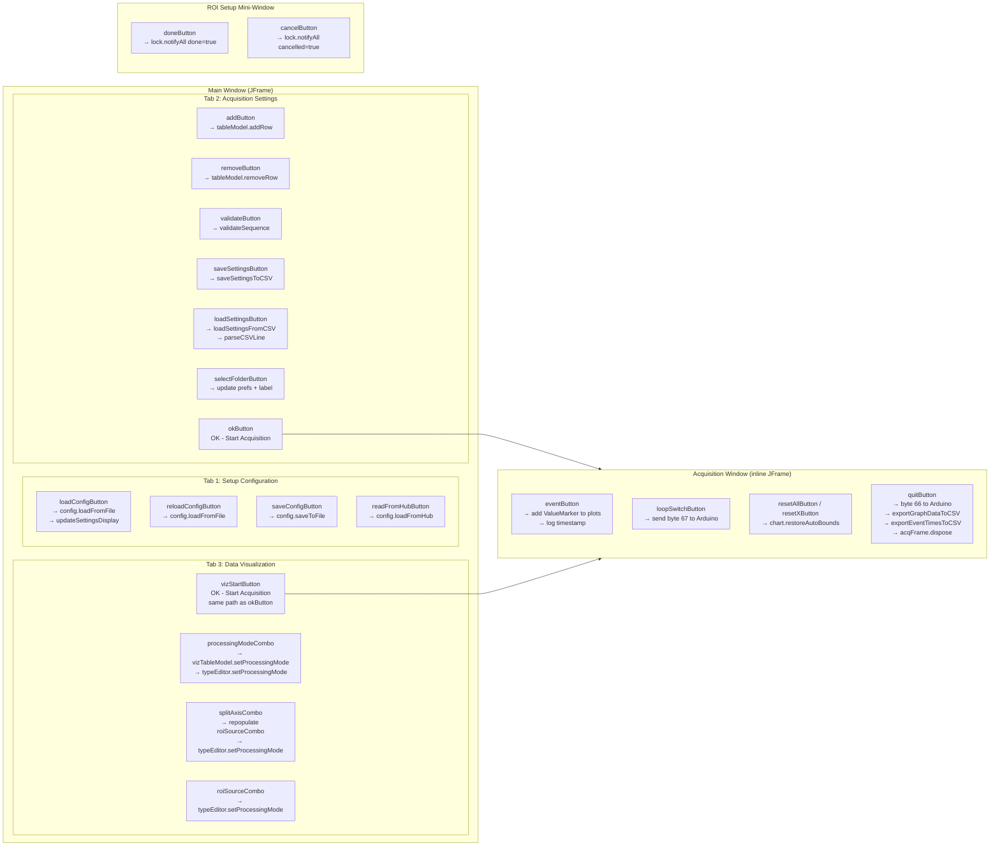

# LUMETRIC Architecture Diagrams

---

## 1. High-Level Acquisition Lifecycle

```mermaid
flowchart TD
    A([Script Start]) --> B[Build GUI\nJFrame + 3 Tabs]
    B --> C{Auto-load\nlast config?}
    C -- yes --> D[config.loadFromFile\nupdateSettingsDisplay]
    C -- no --> E[GUI shown\nframe.setVisible]
    D --> E

    E --> F([User: OK - Start Acquisition])
    F --> G[validateSequence]
    G -- fail --> E
    G -- pass --> H[captureFromGUI\nsnapshot all GUI state into\nconfig.acqSettings]
    H --> I[frame.dispose]
    I --> J[[Background Thread]]

    J --> K[createExperimentFolder\nExperiment_timestamp/images/]
    K --> L{Visualization\nneeded?}
    L -- yes --> M[setupVisualizationROIs\nsnap image, crop half if Spatial\nuser draws ROIs, save RoiSet.zip]
    L -- no --> N
    M --> N[exportTableToCSV\nAquisitionSettings.csv\nAquisitionSettings_Arduino.csv]
    N --> O[[EDT: createInlineAcquisitionWindow\nbuild chart panels, send table to Arduino]]

    O --> P{Mode?}
    P -- Circular Buffer\nhardware triggered --> Q[[runCircularBufferAcquisition]]
    P -- Simple Snap\nor Advanced Sequence --> R[[runAcquisition]]

    Q --> S([User: Quit])
    R --> S

    S --> T[Send byte 66 to Arduino\nstop trigger]
    T --> U[exportGraphDataToCSV\none CSV per active graph]
    U --> V[exportEventTimesToCSV\nEvent-Data.csv]
    V --> W{convertToStack?}
    W -- yes --> X[convertTiffsToStack\nbuild Image_Stack.tif\ndelete individual TIFFs]
    W -- no --> Y
    X --> Y([Done])
```

---

## 2. Circular Buffer Acquisition Path (Hardware TTL)

---

## 3. Software Snap Acquisition Path

---

## 4. Graph Update Logic

---

## 5. GUI Structure & Button Map

