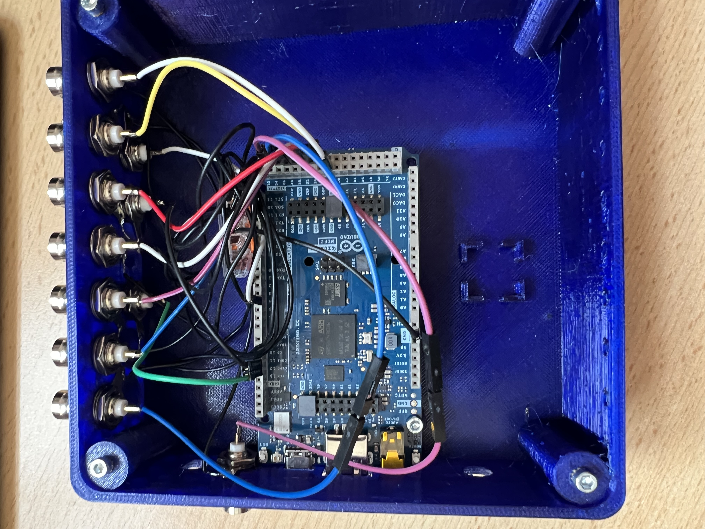

# Hardware: Acquisition Control Box

The LUMETRIC acquisition control box provides hardware-level synchronization for fluorescence microscopy experiments. It integrates an Arduino GIGA R1 running the LUMETRIC firmware and interfaces with MicroManager, light sources, and camera systems.

## Bill of Materials

### Key components

- Arduino GIGA R1
- USB-C to USB-C cable
- BNC connectors (1 for the camera + number of light channels)
- Jumper wires (male header on Arduino side, ≥15 cm length)
- extra wire for ground (you can also use the jumper cables)
- 4-port lever connector (e.g. WAGO)
- Soldering station and lead-free solder
- Wire stripper (suitable for selected wire gauge)
- BNC trigger cables for camera and light source (typically manufacturer-provided)

### Optional components

- TTL logic level converter **IF** you have devices that **do NOT work at 3.3 V** (FREI ST1167 or similar). For this: make sure to check the manual of your camera and light sources!
- 5 x M3 screws (6 mm)
- Heat-set threaded inserts (e.g., RUTHEX GE-M3X5X4)
- 3D-printed enclosure parts

## 3D Printed Enclosure

The enclosure provides structured access to all connectors and ensures mechanical stability.
Alternatively, a custom enclosure (e.g., modified plastic housing) may be used.

!!! Tip "All mechanical design files (CAD/stl) and references are available in:"
    [LUMETRIC Hardware](https://github.com/PSJacoby/LUMETRIC/tree/main/hardware)

The enclosure is a two-part design:

- Bottom shell
- Top cover
- Optional: plugs for unused BNC ports

<video controls width="800">
  <source src="../../assets/videos/demo.mp4" type="video/mp4"/>
</video>

Both parts are secured using screws at the four corners with reinforced mounting stems and support for heat-set inserts.

### Printing recommendations

- Material: PETG or PLA+
- Layer height: ~0.2 mm
- Ensure dimensional accuracy for BNC connector fitting

## Wiring-up the Arduino

### Soldering Steps

It is recommended to use consistent cable color coding to the scheme to simplify debugging and verification.

Refer to the wiring scheme (Figure 1) and the image of a example box (Figure 2).

/// caption
**Fig.1:** Wiring scheme of the Arduino to the BNC connectors.
///

{ align=right }
/// caption
**Fig.2:** Picture of the open box, so that the wiring can be seen.
///

1. **Signal Connections** (BNC center pins)
      1. Cut the jumper wire at one end. Leave an intact male pin at the other side.
      2. Strip approximately 5 mm of insulation from one end.
      3. Ensure that no individual wire strands are protruding.
      4. Tin the exposed wire end with solder.
      5. Solder the wire to the central pin of the BNC connector.
2. **Ground Connections**
      1. Prepare a ground wire per BNC (strip ~5 mm insulation at each end).
      2. Tin both ends.
      3. Solder one end to the **ring terminal** of the BNC connector.
      4. Of one extra Jumper cable: Strip the isolation from one end and tin it.
      5. Insert all ground wires into a lever connector.
      6. The male end of the Jumper cable will connect to an Arduino GND pin.
3. **Installing Heat-Set Inserts**
      1. Place the threaded inserts into the 5 screw sockets.
      2. Use the tip of a soldering iron to heat the threaded insert.
      3. Press it slowly into the designated hole.
      4. Ensure vertical alignment before cooling (e.g. by pressing the last bit with a flat piece of metal).

### Assembly

1. Install the BNC connectors into the enclosure (Ensure ring terminals are correctly placed for ground connections).
2. Mount the Arduino onto the internal standoffs and secure it with one M3 screw.
3. Connect the ground line to the Arduino GND pin (see scheme).
4. Connect the BNC signal wires to Arduino pins (Connector bank J):
5. Perform a final connection check before closing the box.

| Function   | Arduino Pin |
|------------|-------------|
| Camera     | 25          |
| Channel 1  | 27          |
| Channel 2  | 29          |
| Channel 3  | 31          |
| Channel 4  | 33          |
| Channel 5  | 35          |
| Channel 6  | 37          |
| Channel 7  | 38          |

### Optional: Level Shifter Integration

**Important:** Required when interfacing devices that use different voltage logic levels.

A dedicated mounting area is provided for a TTL level shifter module:
Suggested component:  FREI ST1167 or similar
!!! Tip "Refer to the manufacturer's wiring diagram of your specific level shifter for correct connections."

- Enables conversion between 3.3 V and 5 V logic
- Ensures compatibility with camera trigger inputs/outputs

!!! Tip "Always verify the resulting voltage levels using a multimeter **before connecting any 5 V-dependent devices**."

### Continue to installing the LUMETRIC System

From here, you can continue with [installing the software](./Install). Make sure to go through all installation steps if you want to use the full LUMETRIC system.
