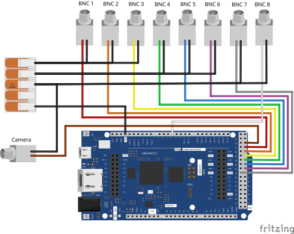
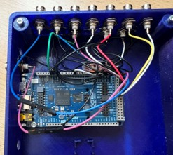

# Acquisition Control Box

The LUMETRIC acquisition control box provides hardware-level synchronization and triggering for fluorescence microscopy experiments. It integrates an Arduino GIGA R1 running the LUMETRIC firmware and interfaces with MicroManager, light sources, and camera systems.

## Bill of Materials

### Key components

- Arduino GIGA R1
- USB-C to USB-C cable
- BNC connectors (1 for the camera + number of light channels)
- Jumper wires (male header on Arduino side, ≥15 cm length)
- extra wire for ground (you can also use the jumper cables)
- 4-port lever connector (e.g. WAGO)
- Soldering station and lead-free solder
- Wire stripper (suitable for selected wire gauge)
- BNC trigger cables for camera and light source (typically manufacturer-provided)

### Optional components

- TTL logic level converter **IF** you have devices that **do NOT work at 3.3 V** (FREI ST1167 or similar)
- 5 x M3 screws (5 mm)
- Heat-set threaded inserts (e.g., RUTHEX GE-M3X5X4)
- 3D-printed enclosure parts

## 3D Printed Enclosure

The enclosure provides structured access to all connectors and ensures mechanical stability.
Alternatively, a custom enclosure (e.g., modified plastic housing) may be used.

!!! Tip "All mechanical design files (CAD/stl) and references are available in:"
    [LUMETRIC Hardware](https://github.com/PSJacoby/LUMETRIC/tree/main/hardware)

The enclosure is a two-part design:

- Bottom shell
- Top cover
- Optional: plugs for unused BNC ports

<video controls>
  <source src="../assets/videos/demo.mp4">
</video>

Both parts are secured using screws at the four corners with reinforced mounting stems and support for heat-set inserts.

### Printing recommendations

- Material: PETG or PLA+
- Layer height: ~0.2 mm
- Ensure dimensional accuracy for BNC connector fitting

## Wiring-up the Arduino

Refer to the wiring scheme (Figure X) and reference images (Figure Y).

### Soldering Steps

It is recommended to use consistent cable color coding to the scheme to simplify debugging and verification.

1. **Signal Connections** (BNC center pins)
      1. Cut the jumper wire at one end. Leave an intact male pin at the other side.
      2. Strip approximately 5 mm of insulation from one end.
      3. Ensure that no individual wire strands are protruding.
      4. Tin the exposed wire end with solder.
      5. Solder the wire to the central pin of the BNC connector.
2. **Ground Connections**
      1. Prepare a ground wire per BNC (strip ~5 mm insulation at each end).
      2. Tin both ends.
      3. Solder one end to the **ring terminal** of the BNC connector.
      4. Of one extra Jumper cable: Strip the isolation from one end and tin it.
      5. Insert all ground wires into a lever connector.
      6. The male end of the Jumper cable will connect to an Arduino GND pin.
3. Installing Heat-Set Inserts
   1. Place the threaded inserts into the 5 screw sockets.
   2. Use the tip of a soldering iron to heat the threaded insert.
   3. Press it slowly into the designated hole.
   4. Ensure vertical alignment before cooling (e.g. by pressing the last bit with a flat piece of metal).

### Assembly

1. Mount the Arduino onto the internal standoffs and secure it with one M3 screw.
2. Install the BNC connectors into the enclosure (Ensure ring terminals are correctly placed for ground connections).
3. Connect the ground line to the Arduino GND pin (see scheme).
4. Connect the BNC signal wires to Arduino pins (Connector bank J):
5. Perform a final connection check before closing the box.

| Function   | Arduino Pin |
|------------|------------|
| Camera     | D25        |
| Channel 1  | D27        |
| Channel 2  | D29        |
| Channel 3  | D31        |
| Channel 4  | D33        |
| Channel 5  | D35        |
| Channel 6  | D37        |
| Channel 7  | D38        |

### Optional: Level Shifter Integration

**Important:** Required when interfacing devices that use different voltage logic levels.

A dedicated mounting area is provided for a TTL level shifter module:
Suggested component:  FREI ST1167 or similar
!!! Tip "Refer to the manufacturer's wiring diagram of your specific level shifter for correct connections."

- Enables conversion between 3.3 V and 5 V logic
- Ensures compatibility with camera trigger inputs/outputs

!!! Tip "Always verify the resulting voltage levels using a multimeter **before connecting any 5 V-dependent devices**."

## Flashing the Firmware

1. Download and install the Arduino IDE: [Arduino IDE](https://docs.arduino.cc/software/ide/).
2. Open the Arduino IDE and navigate to **File > Open**, then select 'LUMETRIC_ArdFirmware.ino' from the LUMETRIC folder.
3. Connect the assembled LUMETRIC control box to your computer via USB-C. The Arduino IDE should automatically detect the board as **Arduino GIGA R1**. Select it from the "**Select board**" dropdown menu.
4. Click the **Upload** button (arrow icon in the top toolbar, left side) to flash the firmware to the Arduino. The console will display a "**Done uploading**" message upon successful completion.
5. Close the Arduino IDE.

## Adding the Arduino as Device in MicroManager

Before proceeding here, make sure you completed the installing stapes described in [Installing MicroManager and integrating your devices](./Install).

1. Make sure MM is **not** running. In the file explorer go to: **programms > MicroManager2.0**. From the LUMETRIC.zip folder you downloaded and unpacked earlier, drag and drop the "**mmgr_dal_Arduino.dll**" into this folder and choose "**replace file**".
2. Open MicroManager and in the **Startup Configuration** Window choose as 'Hardware Configuration File' the LUMETRIC Configuration you generated during [Installing MicroManager and integrating your devices](Install.md).
3. **Devices > Hardware Configuration Wizard**. Choose '**Modify or explore existing configuration**' and make sure its the **LUMETRIC** configuration.

    !!! Tip "If this does not work or you do not want to use 'Scan Ports'"
        You find the COM Port also via the Arduino IDE (but always open either MM or Arduino IDE) or in your Windows Device Manager.

4. Add **Arduino (Arduino Hub)** from the list. Choose "**Scan Ports**".
5. Add the Arduino as shutter and switch.
6. Connect your lamp to the BNC ports of your LUMETRIC box. A good order is increasing wavelength.
7. In MM, define a new group for Presets. Choose the Arduino switch states as single property.
8. Define one Preset per BNC Channel you use. See the table below for the state number to choose.

    !!! Tip "Example: 2 = BNC connector 1"
        You can also define Presets for illumination with two wavelength at the same time. Lets say you want Channel 1 and 2 together: 2 + 4 = 6. Therefore, you choose switch label 6.

9. Check via Live view or simple "shutter open" that each Preset does turn on the wavelength you expect and thus, that your settings are correct.

| Function   | Arduino state |
|------------|------------   |
| Channel 1  | 2             |
| Channel 2  | 4             |
| Channel 3  | 8             |
| Channel 4  | 16            |
| Channel 5  | 32            |
| Channel 6  | 64            |
| Channel 7  | 128           |

## Completing and saving the Configuration of LUMETRIC

TODO Include Image of config 1 and 2

1. Open LUMETRIC via your predefined Quick-Access Button
2. This time, choose: "**Generate Config**"
3. You will see a dialog as depicted in figure x. Be sure to choose the correct Groups and Presets.
   1. Make sure the "**Camera Snap Preset**" uses the internal Trigger while for the "**Camera Trigger Preset**" you have set the Global Shutter + Level Mode + External Trigger mode. If uncertain, recheck [Integrating your devices](./Install).
   2. The Arduino Config Group needs to be the one you used when defining your channels in the previous section. LUMETRIC will draw these automatically from your presets.
4. Leave the Circular Buffer mode checked.
5. Save and apply your settings.

    !!! Tip "COM Port detection of your Arduino"
        In most cases the detected Arduino Serial Port will be the correct one. In the special case of you having multiple Arduinos attached and integrated into MM, it might choose falsely. Double check the Port.

## System Validation

## First test experiment of the full LUMETRIC System

1. Start MicroManager
2. Load configuration
3. Initialize devices
4. Run a test acquisition

Verify:

- Trigger signal output
- Camera synchronization
- Stable acquisition timing

> **Success criteria:** Correct triggering and synchronized device operation.
``
