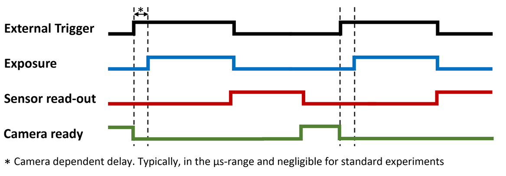
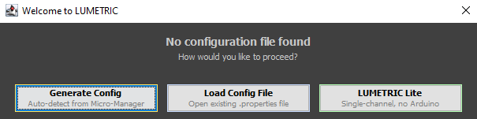
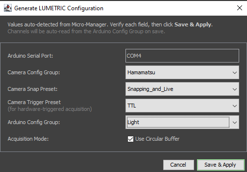

# Software Installation

Start by setting up **LUMETRIC *lite***. Once this is working, you can proceed to install the full **LUMETRIC** system if required.

!!! Important "Prerequisites"
    - A Windows operating system (others might work but are not tested)
    - Manufacturer drivers for all hardware are installed

## MicroManager and LUMETRIC *lite*

If you already operate your Microscope using MicroManager (2.0.3 or higher (2026 or younger)), you may skip ahead to [Implementing LUMETRIC](#implementing-lumetric-as-quick-access-button)

### Installing MicroManager and integrating your devices

1. **Download** the latest version of Micromanager from  [MicroManager](<https://micro-manager.org/Download_Micro-Manager_Latest_Release>).
2. **Install** Micro-Manager and launch the application. In the MM Startup Configuration dialog simply click 'ok'.

    !!! Tip "Additional documentation"
        Detailed installation instructions are provided in the official Micro-Manager
        documentation: [MM Installation](https://micro-manager.org/Micro-Manager_Installation_Notes)

3. **Integrate your hardware** to Micromanager:
    A quick summary:
   i. Open **Devices > Hardware Configuration Wizard ...**
   ii. Create a new configuration file
   iii. Add the camera and light source by selecting the appropriate device adapters from the list of available devices.

    !!! Tip "Documentation"
        Official Micro-Manager documentation for these steps: [Hardware Configuration Wizard](https://micro-manager.org/Micro-Manager_Configuration_Guide)
        For the individual device adapters: [Device Support](https://micro-manager.org/Device_Support)

    ??? Tip "Troubleshooting: If device detection is unsuccessful"
        The port detection and standard settings are largely automated in MM. You will find device adapters for the most common devices. Check out the individual docs of the adapters [Device Support](https://micro-manager.org/Device_Support). If this does not work out:
        - Verify that the correct manufacturer drivers are installed
        - Check the Windows Device Manager for device visibility
        - Confirm correct COM port assignment for serial devices
        - Consult the manufacturer’s hardware documentation

4. **Configure your Presets:**
   It is recommended to at least define individual groups for camera and light source. Depending on your hardware, MM allows also integration of microscope bodies, stages and more.
   **Include as many settings as needed** in your groups and presets but **as little as possible**. Over-defining presets on shared microscopes may lead to silent setting changes.
   If you use a TTL-controlled (Arduino controlled) light source, you will find further information in [Acquisition Control Box](../Configuration/ArduinoAssembly).
   For the camera, it is recommended to define a "Snapping and live" mode, where you use the internal trigger mode (thus controlled via serial connection to MM).
   If the full LUMETRIC-Version is to be used, configure a second camera preset "LUMETRIC" that allows TTL-triggering via Arduino. Example camera presets for a Hamamatsu device can be found in the table below. Depending on the camera, the nomenclature might differ. If uncertain which settings to use for TTL-triggering mode, check the camera manual for a behavior as depicted in figure 1.

| Property Name                     | LUMETRIC    | Snapping-and Live|
|-----------------------------------|-------------|-------------     |
| Quest-TRIGGER ACTIVE              | LEVEL       |LEVEL             |
| Quest-TRIGGER GLOBAL EXPOSURE     | GLOBAL RESET|GLOBAL RESET      |
| Quest-TRIGGER SOURCE              | EXTERNAL    |INTERNAL          |
| Quest-Trigger                     | NORMAL      |NORMAL            |
| Quest-TriggerPolarity             | POSITIVE    |POSITIVE          |

{width=800}
/// caption
**Fig.1:** Camera behavior to look for in the individual manuals.
Most likely called something like: Global reset Level trigger mode.
///

1. Before continuing, acquire some test images using the configured "Snapping and live" camera mode and illumination presets.
2. When you close MM using the **File > quit** option in the **ImageJ** window, it shuts down orderly and will remember your window positioning the next time.
Also, it will ask you if you want to **save your Hardware configuration**. Please do so.

    !!! Tip "Getting started with MicroManager"
        A detailed description of the Micro-Manager user interface and basic workflows is available in the official user guide: [MM User Guide](https://micro-manager.org/Version_2.0_Users_Guide)

    !!! Tip "Make sure you have set enough memory"
        Both ImageJ and MM need to have enough memory. What to set depends on your RAM. Restart MM after changing these settings.
        For ImageJ: Edit > Options > Memory and Threads
        For MM: Tools > Options > Sequence buffer size

### Implementing LUMETRIC as Quick-Access-Button

LUMETRIC *lite* is distributed as a Micro-Manager BeanShell script and does not
require compilation or modification of Micro-Manager installation files.

1. Download the LUMETRIC-Repository ([LUMETRIC](https://github.com/PSJacoby/LUMETRIC))  using the `<> Code` button and select *Download ZIP*. After unpacking, you will find LUMETRIC.bsh inside.  This is all you need to run LUMETRIC *lite*.
2. In MM, go to **Tools > Quick Access Panel > Create New Panel**. In the left corner of the new pop-up window, click on the wheel-symbol. Here, you will add LUMETRIC in the next step, but it also possible to e.g. add presets of other commodities like often used light source channels or similar.
3. Drag-and-drop the "**Run Script**" control button on a free green rectangle. This will open a file-browser. Select the **LUMETRIC.bsh** script.
4. By clicking the wheel symbol again, you finish the process.
5. MM will open the Quick access panel automatically again when opening the program, as long as you do not close the panel itself. To avoid accidental panel loss, I recommend to save it via **Tools > Quick Access Panel > Save Settings**.

!!! Tip "Alternative execution method"
    The Quick Access Panel is a convenience feature and not required. You can also execute LUMETRIC via **Tools > Script Panel**. There, click "**add**" and choose **LUMETRIC.bsh**, Click "**Run**" to execute the script.

### Run your first test experiment on LUMETRIC *lite*

1. Open LUMETRIC via your predefined Quick-Access Button
2. Choose: '**LUMETRIC Lite**'

{width=500}
/// caption
**Fig.1:** User dialog if no LUMETRIC Configuration is available.
///

A introduction in how to set-up an experiment with LUMETRIC *lite*  can be found in [LUMETRIC lite](../LUMETRIC%20GUI/Singlechannel). If you would like to start with a concise overview of all options you are offered by LUMETRIC, check out [LUMETRIC GUI](../LUMETRIC%20GUI/Interface).
If you want to set up a full LUMETRIC system, continue with [Aquisition Control Box](./ArduinoAssembly).

## Flashing the Firmware of your Acquisition Control Box

Continue here when you are done building the [Aquisition Control Box](./ArduinoAssembly).

1. Download and install the Arduino IDE: [Arduino IDE](https://docs.arduino.cc/software/ide/).
2. Open the Arduino IDE and navigate to **File > Open**, then select 'LUMETRIC_ArdFirmware.ino' from the **LUMETRIC** folder **> src** folder. Allow it to automatically create the needed folder for the IDE.
3. Connect the assembled LUMETRIC control box to your computer via USB. The Arduino IDE might ask you now to allow some additional downloads and installations within the IDE. When this is completed,the Arduino IDE should automatically detect the board as **Arduino GIGA R1**. Select it from the '**Select board**' dropdown menu.
4. Click the **Upload** button (arrow icon in the top toolbar, left side) to flash the firmware to the Arduino. The console will display a '**Done uploading**' message upon successful completion.
5. Close the Arduino IDE.

## Adding the Arduino as Device in MicroManager

Before proceeding here, make sure you completed the installing steps described in [Installing MicroManager and integrating your devices](./Install) and your Aquisition Control box is connected via USB to your computer.

1. Make sure MM is **not** running. In the file explorer go to: **programm files > MicroManager2.0**. From the LUMETRIC.zip folder you downloaded and unpacked earlier ([LUMETRIC](https://github.com/PSJacoby/LUMETRIC)), drag and drop the '**mmgr_dal_Arduino.dll**' into this folder and choose '**replace file**'.
2. Open MicroManager and in the **Startup Configuration** Window choose as 'Hardware Configuration File' the LUMETRIC Configuration you generated during [Installing MicroManager and integrating your devices](Install.md).
3. **Devices > Hardware Configuration Wizard**. Choose '**Modify or explore existing configuration**' and make sure its the **LUMETRIC** configuration.

    !!! Tip "If this does not work or you do not want to use 'Scan Ports'"
        You find the COM Port also via the Arduino IDE (but always open either MM or Arduino IDE) or in your Windows Device Manager.

4. Add **Arduino (Arduino Hub)** from the list. Choose "**Scan Ports**".
5. Add the Arduino as hub: tick **shutter** and **switch**.
6. Choose the **Arduino as standard shutter** when proceeding through the dialog. For everything else, keep default.
7. Connect your camera external trigger cable to the camera BNC of your Acquisition Control Box. Make sure to use the correct port on the camera.
8. Connect your lamp to the BNC ports of your LUMETRIC box. A good order is increasing wavelength.
9. In MM, define a new group for Presets. Choose the Arduino switch label as the only property.
10. Define one Preset per BNC Channel you use. See the table below for the state number to choose.
    !!! Tip "Example: 2 = BNC connector 1"
        You can also define Presets for illumination with two wavelength at the same time. Lets say you want Channel 1 and 2 together: 2 + 4 = 6. Therefore, you choose switch label 6.

11. Check via Live view or simple 'shutter open' that each Preset does turn on the wavelength you expect and thus, that your settings are correct.

| Function   | Arduino state |
|------------|------------   |
| Channel 1  | 2             |
| Channel 2  | 4             |
| Channel 3  | 8             |
| Channel 4  | 16            |
| Channel 5  | 32            |
| Channel 6  | 64            |
| Channel 7  | 128           |

!!! Tip "Troubleshooting"
    Depending on your devices you have to allow your camera and light source explicitly to be triggered via TTL-pulses. If camera or light source do not react but you double checked your cabels and presets, that is a common point to check for.

## Completing and saving the Configuration of LUMETRIC

1. Open LUMETRIC via your predefined Quick-Access Button
2. This time, choose: '**Generate Config**' (Fig. 1 below)
3. You will see a dialog as depicted in figure 2 below. Be sure to choose the correct Groups and Presets.
      1. Make sure the "**Camera Snap Preset**" uses the internal Trigger while for the "**Camera Trigger Preset**" you have set the Global Shutter + Level Mode + External Trigger mode. If uncertain, recheck [Integrating your devices](./Install).
      2. The Arduino Config Group needs to be the one you used when defining your channels in the previous section. LUMETRIC will draw these automatically from your presets.

    !!! Tip "COM Port detection of your Arduino"
        In most cases the detected Arduino Serial Port will be the correct one. In the special case of you having multiple Arduinos attached and integrated into MM, it might choose falsely. Double check the Port.

4. Leave the Circular Buffer mode checked.
5. Save and apply your settings.

{width=500}
/// caption
**Fig.1:** User dialog if no LUMETRIC Configuration is available.
///

{width=500}
/// caption
**Fig.1:** User dialog of the LUMETRIC Configuration wizard.
///

## First test experiment of the full LUMETRIC System

If you would like to start with a concise overview of all options you are offered by LUMETRIC, check out [LUMETRIC GUI](../LUMETRIC%20GUI/Interface). A quick introduction in how to set-up an experiment with LUMETRIC can be found in [LUMETRIC](../LUMETRIC%20GUI/Multichannel).
