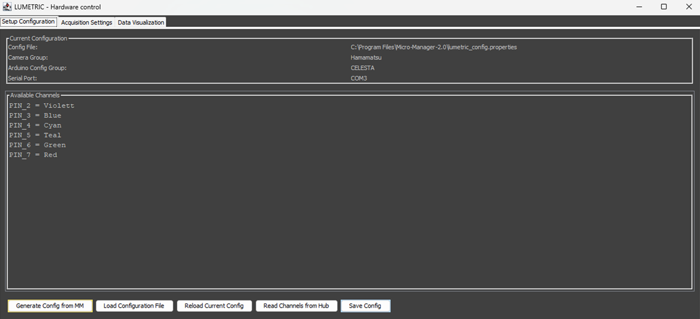
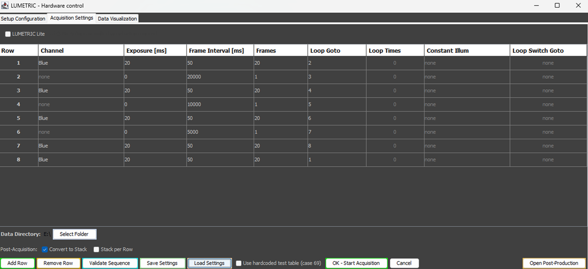
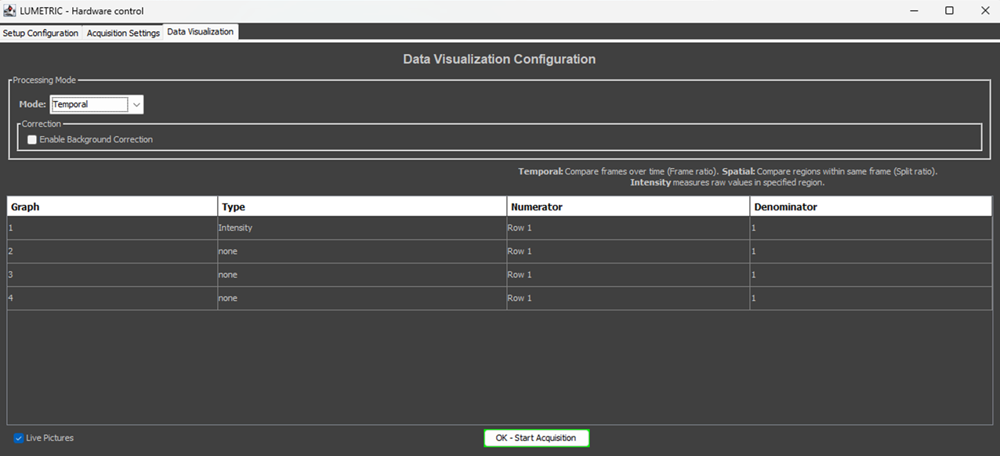
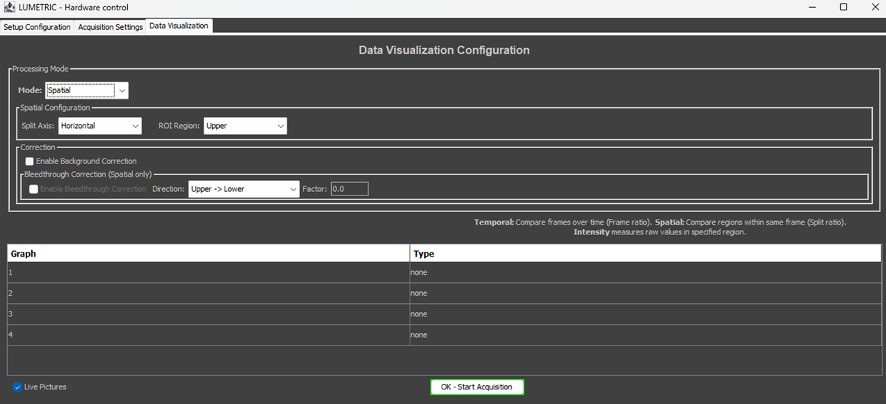
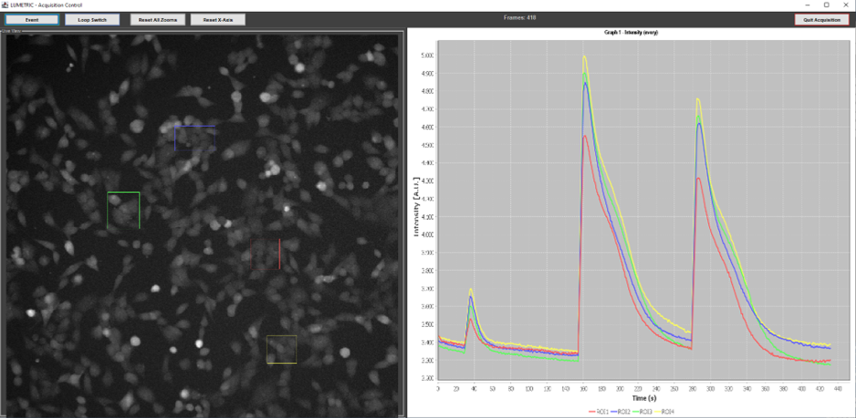

# Interface Overview

The LUMETRIC interface is a single window titled **LUMETRIC – Hardware control**, organized into three tabs. The first tab configures hardware, the second builds the acquisition sequence, and the third defines live visualization. Starting an acquisition hides this window and opens a separate live **Acquisition Window**. A **Post-Production** window is available for re-analyzing finished experiments.

The same interface drives both operating modes:

- **LUMETRIC** (full system) - hardware-triggered acquisition through the Acquisition control box.
- **LUMETRIC *lite*** - software-controlled acquisition with no extra hardware. Captures one channel only using only the GUI exposure and interval settings.

## Window structure

The following windows will be explained here:

- **Tab 1 - Setup Configuration:** load, generate, reload, and save the `.properties` configuration; inspect the available channels.
- **Tab 2 - Acquisition Settings:** select the operating mode, build the sequence table, choose the save folder, set post-acquisition stack options, and start the run.
- **Tab 3 - Data Visualization:** choose the data processing mode (Spatial/ Temporal), configure up to four live graphs, enable corrections, and start the run.
- **Acquisition Window:** live camera view and graphs shown during a run, with event, loop-switch, zoom-reset, and quit controls.
- **Post-Production Window:** reopen a finished experiment folder to refine ROIs and re-export corrected data.
- **Data Export Folder**

On startup, the interface opens on the Acquisition Settings tab if a configuration was used previously, or on the Setup Configuration tab in case of a fresh installation.

## Tab 1 - Setup Configuration

This tab displays the active configuration and the channel list, and provides the configuration management buttons. The **Current Configuration** panel shows the config file path, camera group, Arduino config group, and serial port. The **Available Channels** panel lists each `PIN_n = channel` mapping.

{width=750}
/// caption
**Fig.1:** Tab 1 - Setup Configuration.
///

### Buttons

- **Generate Config from MM** — auto-detects settings from the running Micro-Manager instance (config groups, presets, and the Arduino COM port) and opens a verify-and-save dialog to write a new `.properties` file. Use this to create a configuration.
- **Load Configuration File** — opens a file chooser to load an existing `.properties` configuration. On success, the channel list updates, and the interface switches to the Acquisition Settings tab. Useful if you run your setup with different device combinations.
- **Reload Current Config** — re-reads the currently loaded configuration file from disk, picking up any external edits.
- **Read Channels from Hub** — queries the Micro-Manager Arduino Switch device and populates the channel list automatically from its presets. Each preset that corresponds to an individual BNC connection is loaded as channel.
- **Save Config** — writes the current channel/pin configuration back to the loaded config file (asks for confirmation before overwriting).

!!! Note "LUMETRIC vs LUMETRIC *lite*"
    The Arduino config group, serial port, and **Read Channels from Hub** apply to the full system only. In *lite* mode, the configuration is **not** required.

## Tab 2 — Acquisition Settings

This tab is the main control. It builds the acquisition sequence,starts the run and grands access to post-processing.

{width=750}
/// caption
**Fig.2:** Tab 2 - Acquisition Setting.
///

### Mode selection

- **LUMETRIC *Lite*** (checkbox) — when ticked, runs single-channel snap acquisition using only the GUI exposure and frame Interval settings of Row 1, without Acquisition-Control-Box or multi-channel automation. When unticked, runs the full hardware-triggered sequence.

### Sequence table

Each row defines one acquisition setting. Up to 20 rows are supported.

| Column | Purpose |
|--------|---------|
| **Channel** | Illumination channel(s) during exposure for the step. Clicking the cell opens a checkbox dialog listing the available channels. Select one or several.|
| **Exposure [ms]** | LED on-time and camera exposure per frame. Be aware that the true exposure times are curbed by the cameras. Typical limits are around 2000 ms. 0 ms creates a pause row (no camera trigger). Helpful for additions or incubation times. |
| **Frame Interval [ms]** | Full frame period including exposure and the inter-frame gap (0–60000). Must be > exposure. |
| **Frames** | Number of frames to capture with these settings (0–60000) before triggering a switch to the "Loop Goto". 0 works as infinity (no looping to Loop Goto). Stops only if Quit is pressed or Loop Switch if configured. |
| **Loop Goto** | Row to jump back to once the frame count is reached. Auto-filled to the next row; the last row defaults to looping back to the first. |
| **Loop Times** | Number of loop repetitions. It will jump these many times to the Row set in Loop Goto. Empty or 0 means infinite (shown as 0 ). After the number of Loop Times is reached, the acquisition jumps to the row underneath it. |
| **Constant Illum** | Channel(s) held on during the inter-frame gap and the Exposure time. A channel already in the Exposure Channel list cannot also be a constant-illumination channel. |
| **Loop Switch Goto** | Row to jump to when the **Loop Switch** button is pressed during acquisition. Empty means disabled (shown as none). |

!!! Note "LUMETRIC vs LUMETRIC *lite*"
    Channel switching, Constant Illum, Loop Goto / Loop Times, Loop Switch Goto, and constant illumination are hardware features executed by the Arduino. In *lite* mode the run uses the GUI exposure and interval only; multi-row channel automation does not apply.

### Sequence control buttons

- **Add Row** — appends a new sequence row.
- **Remove Row** — deletes the currently selected row.
- **Validate Sequence** — checks the table for logic errors before starting; the same validation runs automatically when an acquisition is started.
- **Save Settings** — exports the current acquisition table and visualization settings to a re-loadable CSV file.
- **Load Settings** — restores acquisition and visualization settings from a previously saved CSV file.
- **Use hardcoded test table (case 69)** (checkbox) — bypasses the serial table upload and loads a fixed test pattern directly on the Arduino (one LED, 100 ms exposure, 1000 ms interval). Intended for hardware bring-up and diagnostics.
- **OK – Start Acquisition** — validates the sequence, asks for a save folder if none is set, saves all GUI settings, hides the main window, and launches the acquisition.
- **Cancel** — closes the interface without starting.
- **Open Post-Production** — opens a finished experiment folder to refine ROIs and re-export data (see [Post-Production](#post-production-window)).

### Save folder and post-acquisition options

- **Data Directory / Select Folder** — chooses the directory where experiment data is written. The selected path is remembered between sessions. A folder is required before acquisition can start.
- **Convert to Stack** (checkbox, on by default) — after acquisition, combines the individual `Frame_XXXXX.tif` files into a single stack and deletes the originals.
- **Stack per Row** (checkbox) — after acquisition, creates one TIFF stack per sequence row. Can be combined with **Convert to Stack**.

!!! Tip "Images are always saved"
    Every acquired frame is written to disk regardless of the stack options or the **Live Pictures** checkbox. If you uncheck everything regarding that you will have a folder with each frame as individual file.

## Tab 3 — Data Visualization

This tab configures the real-time analysis and graphs. Up to four graphs can be displayed during acquisition.

### Processing mode

- **Mode** (Temporal / Spatial)
  - **Temporal** — compares ROI intensities across frames over time. Graph types: **Intensity** and **Ratio** (frame ratio).
  - **Spatial** — compares two halves of the same frame (dual-view / split-image). ROIs are drawn on one half and mirrored to the other. Graph types: **Split ratio** and **Intensity**.

### Temporal mode

{width=750}
/// caption
**Fig.3:** Tab 3 - Temporal mode.
///

### Spatial mode

{width=750}
/// caption
**Fig.4:** Tab 3 - Spatial mode.
///

- **Split Axis** (combo: Horizontal / Vertical) — the axis along which each frame is split.
- **ROI Region** (combo) — which half the ROIs are drawn on. Options follow the split axis: Upper/Lower for Horizontal, Left/Right for Vertical.

### Graph table

| Column | Purpose |
|--------|---------|
| **Graph** | Graph number (1–4). |
| **Type** | Graph type for this row. In Temporal mode: Intensity or temporal ratio. In Spatial mode: split-ratio directions (e.g. Upper/Lower) and intensities (e.g. Intensity Upper). |
| **Numerator** | (Temporal only) Sequence row whose frames feed the graph. All Rows accepts frames from any row — useful for single-row experiments or plain intensity graphs. |
| **Denominator** | (Temporal only) Sequence row used as the divisor for ratio graphs. Locked to 1 for Intensity. |

The Numerator/Denominator dropdowns list the available sequence rows and update automatically when rows are added or removed.

### Corrections

- **Enable Background Correction** (checkbox) — subtracts a designated background ROI from all measured ROIs. The background ROI is selected after starting, during ROI setup. Available in both modes.
- **Enable Bleedthrough Correction** (checkbox, Spatial mode only) — subtracts a scaled source-half signal from the mirror half to correct spectral bleedthrough. Enabled only when Background Correction is also active.
  - **Direction** (combo) — the physical bleedthrough direction (e.g. Upper → Lower), independent of where ROIs are drawn.
  - **Factor** (text field) — the bleedthrough correction factor; accepts `,` or `.` as the decimal separator.

### Start

- **Live Pictures** (checkbox) — shows the live camera view in the Acquisition Window during the run. Controls GUI display only; images are always saved. Uncheck to reduce overhead during fast or long acquisitions.
- **OK – Start Acquisition** — same as on the Acquisition Settings tab: validates, asks for a save folder if needed, captures all settings, and launches the run. If validation fails, the interface switches to the Acquisition Settings tab to show the errors.

!!! Note "LUMETRIC vs LUMETRIC *lite*"
    Temporal/ Spatial analysis, live graphs, background and bleedthrough correction, and post-processing are available in **all** modes. Per-row graph filtering is most useful for multi-row (full-system) sequences; in *lite* mode a single row is used, so `All Rows` is the natural Numerator setting.

## ROI Selection

If no ROIs are defined, the calculations are made as one ROI over the whole field of view.

## Acquisition Window

Starting an acquisition opens an inline window containing the live camera view (if **Live Pictures** is enabled) and the configured graphs. ROIs drawn at the start are overlaid on the live image. Graphs update in real time, throttled to roughly 250 ms.

{width=750}
/// caption
**Fig.4:** Aquisition Window.
///

### Controls

- **Event** — logs a timestamp and draws a vertical marker line across all active graphs, for annotating stimulus or intervention times.
- **Loop Switch** — sends the switch command to the Arduino, causing the currently active row to jump to its **Loop Switch Goto** target. The Arduino confirms with a notification packet, and the live graphs' row assignments are corrected retroactively so plotting stays consistent. *(Full system only.)*
- **Reset X / Reset All** — restores automatic axis bounds for one graph or for all graphs.
- **Quit Acquisition** — stops the Arduino (full system), stops the run, exports all graph data and event timestamps to CSV, optionally assembles the image stack, and returns to the main interface.

## Data Export folder

Each run creates a timestamped experiment folder containing:

- `Frame_XXXXX.tif` individual frames (5-digit zero-padded), or an assembled `Image_Stack.tif` / per-row stacks when stack conversion is enabled
- `AquisitionSettings.csv` (human-readable) and `AquisitionSettings_Arduino.csv` (pin/byte values)
- `Graph{N}_{type}_{frameFilter}_{corrLevel}.csv` for each active graph (corrLevel: RAW, BGcorr, BTcorr, BTDEcorr)
- Event timestamps as CSV
- `RoiSet.zip` (ImageJ format)

## Post-Production Window

Opened via **Open Post-Production**, this window re-analyzes a completed experiment without re-acquiring.

### Workflow and controls

1. Select an existing experiment folder. Settings and imaging data load automatically.
2. Draw ROIs in the ROI Manager, or restore a previously saved ROI set.
3. **Recalculate** — re-measures all stack slices with the current ROIs and refreshes the graphs.
4. **Export** — writes corrected data to a new numbered sub-folder beside the original experiment.

Correction levels exported depend on what is enabled:

- **RAW** — always exported.
- **BGcorr** — when Background Correction is enabled.
- **BTcorr** — when Bleedthrough Correction is enabled (Spatial only).
- **BTDEcorr** — when **Direct Excitation correction** is enabled. This post-processor-only correction subtracts a scaled acceptor offset to remove direct excitation of the acceptor by the donor laser. It requires Bleedthrough Correction, uses a reference stack and a frame range to compute the per-ROI offset, and follows the same correction direction setting as bleedthrough.
